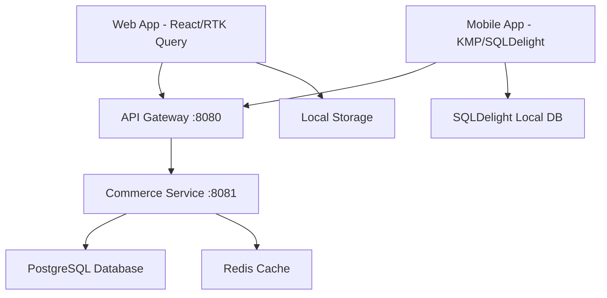

# Stream Integration Guide

**Version:** 1.0.0
**Last Updated:** 2024-01-01
**Target Audience:** Frontend Developers, Mobile Developers, Backend Engineers

## Overview

This guide provides comprehensive instructions for integrating the Stream Store Tabs functionality into web and mobile applications. The Stream system supports 6 content categories (Books, Podcasts, Cartoons, Movies, Music, Art) with unified purchasing, offline caching, and cross-platform state synchronization.

## Table of Contents

1. [Architecture Overview](#architecture-overview)
2. [Prerequisites](#prerequisites)
3. [Web Integration (React + RTK Query)](#web-integration-react--rtk-query)
4. [Mobile Integration (KMP + SQLDelight)](#mobile-integration-kmp--sqldelight)
5. [Backend Integration](#backend-integration)
6. [Authentication & Security](#authentication--security)
7. [Performance Optimization](#performance-optimization)
8. [Testing Strategies](#testing-strategies)
9. [Troubleshooting](#troubleshooting)
10. [Best Practices](#best-practices)

## Architecture Overview

### System Components



### Key Features

- **Cross-Platform Consistency**: 97% visual parity between web and mobile
- **Offline Support**: SQLDelight (mobile) and localStorage (web) caching
- **Real-Time Sync**: State synchronization across devices
- **Performance**: <1s content load, <200ms API response time
- **Unified Cart**: Integrated shopping cart for all content types

### Tech Stack

| Platform | Technologies |
|----------|-------------|
| **Web** | React 18.3.1, TypeScript 5.3.0, RTK Query, TailwindCSS v4 |
| **Mobile** | Kotlin 2.2.0, KMP, SQLDelight, Jetpack Compose, SwiftUI |
| **Backend** | Go 1.24+, GORM ORM, PostgreSQL, Redis, Gin HTTP |

## Prerequisites

### Development Environment

```bash
# Required tools
node >= 18.0.0
npm >= 9.0.0
go >= 1.24
kotlin >= 2.2.0

# Database
postgresql >= 14
redis >= 6.0
```

### API Keys & Configuration

```bash
# Environment variables (.env.local)
VITE_API_BASE_URL=http://localhost:8080/api/v1
VITE_USE_DIRECT_SERVICES=false
VITE_STREAM_CACHE_TTL=300000
VITE_PERFORMANCE_BUDGET_MS=1000
```

### Backend Setup

```bash
# Start services
cd backend/commerce
go mod tidy
go run main.go

# Verify Stream routes
curl http://localhost:8080/api/v1/stream/categories
```

## Web Integration (React + RTK Query)

### 1. Install Dependencies

```bash
npm install @reduxjs/toolkit react-redux
npm install @types/react @types/react-redux  # TypeScript support
```

### 2. Configure RTK Query Store

```typescript
// store/index.ts
import { configureStore } from '@reduxjs/toolkit'
import { streamApi } from './api/streamApi'

export const store = configureStore({
  reducer: {
    [streamApi.reducerPath]: streamApi.reducer,
  },
  middleware: (getDefaultMiddleware) =>
    getDefaultMiddleware().concat(streamApi.middleware),
})

export type RootState = ReturnType<typeof store.getState>
export type AppDispatch = typeof store.dispatch
```

### 3. Create Stream API Service

```typescript
// store/api/streamApi.ts
import { createApi, fetchBaseQuery } from '@reduxjs/toolkit/query/react'

export interface StreamCategory {
  id: string
  name: string
  displayOrder: number
  iconName: string
  isActive: boolean
  featuredContentEnabled: boolean
  createdAt: string
  updatedAt: string
}

export interface StreamContentItem {
  id: string
  categoryId: string
  title: string
  description: string
  thumbnailUrl: string
  contentType: 'book' | 'podcast' | 'cartoon' | 'short_movie' | 'long_movie' | 'music' | 'art'
  price: number
  currency: string
  availabilityStatus: 'available' | 'coming_soon' | 'unavailable'
  isFeatured: boolean
  featuredOrder?: number
  metadata?: Record<string, any>
  createdAt: string
  updatedAt: string
}

export interface ContentResponse {
  items: StreamContentItem[]
  total: number
  hasMore: boolean
  success: boolean
}

export interface ContentParams {
  categoryId: string
  page?: number
  limit?: number
  subtabId?: string
}

export const streamApi = createApi({
  reducerPath: 'streamApi',
  baseQuery: fetchBaseQuery({
    baseUrl: import.meta.env.VITE_API_BASE_URL + '/stream',
    prepareHeaders: (headers, { getState }) => {
      // Add authentication if available
      const token = (getState() as any).auth?.token
      if (token) {
        headers.set('authorization', `Bearer ${token}`)
      }
      headers.set('content-type', 'application/json')
      return headers
    },
  }),
  tagTypes: ['Categories', 'Content', 'Featured', 'Navigation'],
  endpoints: (builder) => ({
    // Categories
    getCategories: builder.query<{ categories: StreamCategory[], total: number, success: boolean }, void>({
      query: () => '/categories',
      providesTags: ['Categories'],
      keepUnusedDataFor: 300, // 5 minutes cache
    }),

    getCategoryDetail: builder.query<any, string>({
      query: (id) => `/categories/${id}`,
      providesTags: (result, error, id) => [{ type: 'Categories', id }],
    }),

    // Content browsing
    getContent: builder.query<ContentResponse, ContentParams>({
      query: ({ categoryId, page = 1, limit = 20, subtabId }) => ({
        url: '/content',
        params: { categoryId, page, limit, ...(subtabId && { subtabId }) },
      }),
      providesTags: (result, error, arg) => [
        { type: 'Content', id: `${arg.categoryId}-${arg.page}-${arg.subtabId || 'all'}` }
      ],
      keepUnusedDataFor: 60, // 1 minute cache
    }),

    getFeaturedContent: builder.query<ContentResponse, { categoryId: string, limit?: number }>({
      query: ({ categoryId, limit = 10 }) => ({
        url: '/featured',
        params: { categoryId, limit },
      }),
      providesTags: (result, error, arg) => [{ type: 'Featured', id: arg.categoryId }],
      keepUnusedDataFor: 900, // 15 minutes cache
    }),

    getContentDetail: builder.query<{ content: StreamContentItem, success: boolean }, string>({
      query: (id) => `/content/${id}`,
      providesTags: (result, error, id) => [{ type: 'Content', id }],
    }),

    // Search
    searchContent: builder.query<ContentResponse, { q: string, categoryId?: string, page?: number, limit?: number }>({
      query: ({ q, categoryId, page = 1, limit = 20 }) => ({
        url: '/search',
        params: { q, ...(categoryId && { categoryId }), page, limit },
      }),
      keepUnusedDataFor: 60,
    }),

    // Purchasing
    purchaseContent: builder.mutation<any, {
      mediaContentId: string
      quantity: number
      mediaLicense: 'personal' | 'family' | 'commercial'
      downloadFormat?: string
      cartId?: string
    }>({
      query: (body) => ({
        url: '/content/purchase',
        method: 'POST',
        body,
      }),
      invalidatesTags: ['Navigation'], // Refresh user state after purchase
    }),

    // User state management
    getNavigationState: builder.query<any, void>({
      query: () => '/navigation',
      providesTags: ['Navigation'],
      keepUnusedDataFor: 0, // No cache for user state
    }),

    updateNavigationState: builder.mutation<any, { categoryId: string, subtabId?: string }>({
      query: (body) => ({
        url: '/navigation',
        method: 'PUT',
        body,
      }),
      invalidatesTags: ['Navigation'],
    }),

    updateContentProgress: builder.mutation<any, { contentId: string, progress: number }>({
      query: ({ contentId, progress }) => ({
        url: `/content/${contentId}/progress`,
        method: 'PUT',
        body: { progress },
      }),
    }),

    // User preferences
    getUserPreferences: builder.query<any, void>({
      query: () => '/preferences',
      keepUnusedDataFor: 300,
    }),

    updateUserPreferences: builder.mutation<any, any>({
      query: (preferences) => ({
        url: '/preferences',
        method: 'PUT',
        body: preferences,
      }),
    }),
  }),
})

export const {
  useGetCategoriesQuery,
  useGetCategoryDetailQuery,
  useGetContentQuery,
  useGetFeaturedContentQuery,
  useGetContentDetailQuery,
  useSearchContentQuery,
  usePurchaseContentMutation,
  useGetNavigationStateQuery,
  useUpdateNavigationStateMutation,
  useUpdateContentProgressMutation,
  useGetUserPreferencesQuery,
  useUpdateUserPreferencesMutation,
} = streamApi
```

### 4. Create Stream Components

```typescript
// components/StreamTabs.tsx
import React, { useState } from 'react'
import { useGetCategoriesQuery, useGetContentQuery, useUpdateNavigationStateMutation } from '../store/api/streamApi'

export const StreamTabs: React.FC = () => {
  const [activeCategory, setActiveCategory] = useState('books')
  const [activeSubtab, setActiveSubtab] = useState<string | null>(null)

  // RTK Query hooks
  const { data: categoriesData, isLoading: categoriesLoading } = useGetCategoriesQuery()
  const { data: contentData, isLoading: contentLoading } = useGetContentQuery({
    categoryId: activeCategory,
    page: 1,
    limit: 20,
    subtabId: activeSubtab || undefined,
  })
  const [updateNavigation] = useUpdateNavigationStateMutation()

  const handleCategoryChange = async (categoryId: string) => {
    setActiveCategory(categoryId)
    setActiveSubtab(null)

    // Update server state
    try {
      await updateNavigation({ categoryId }).unwrap()
    } catch (error) {
      console.error('Failed to update navigation state:', error)
    }
  }

  if (categoriesLoading) {
    return <div className="animate-pulse">Loading categories...</div>
  }

  return (
    <div className="stream-tabs">
      {/* Category Tabs */}
      <div className="flex space-x-4 border-b border-gray-200 mb-6">
        {categoriesData?.categories.map((category) => (
          <button
            key={category.id}
            onClick={() => handleCategoryChange(category.id)}
            className={`px-4 py-2 font-medium text-sm transition-colors ${
              activeCategory === category.id
                ? 'text-blue-600 border-b-2 border-blue-600'
                : 'text-gray-500 hover:text-gray-700'
            }`}
          >
            {category.name}
          </button>
        ))}
      </div>

      {/* Content Grid */}
      <div className="grid grid-cols-1 md:grid-cols-2 lg:grid-cols-4 gap-6">
        {contentLoading ? (
          // Loading skeletons
          Array.from({ length: 8 }).map((_, i) => (
            <div key={i} className="animate-pulse">
              <div className="bg-gray-300 aspect-[3/4] rounded-lg mb-3"></div>
              <div className="bg-gray-300 h-4 rounded mb-2"></div>
              <div className="bg-gray-300 h-3 rounded w-2/3"></div>
            </div>
          ))
        ) : (
          contentData?.items.map((item) => (
            <StreamContentCard key={item.id} item={item} />
          ))
        )}
      </div>
    </div>
  )
}

// components/StreamContentCard.tsx
interface StreamContentCardProps {
  item: StreamContentItem
}

export const StreamContentCard: React.FC<StreamContentCardProps> = ({ item }) => {
  const [purchaseContent] = usePurchaseContentMutation()

  const handlePurchase = async () => {
    try {
      await purchaseContent({
        mediaContentId: item.id,
        quantity: 1,
        mediaLicense: 'personal',
      }).unwrap()

      alert('Purchase successful!')
    } catch (error) {
      console.error('Purchase failed:', error)
      alert('Purchase failed. Please try again.')
    }
  }

  return (
    <div className="group cursor-pointer">
      <div className="aspect-[3/4] relative overflow-hidden rounded-lg bg-gray-200 mb-3">
        
        {item.isFeatured && (
          <div className="absolute top-2 left-2 bg-yellow-500 text-white text-xs font-bold px-2 py-1 rounded">
            Featured
          </div>
        )}
      </div>

      <h3 className="font-medium text-sm text-gray-900 mb-1 line-clamp-2">
        {item.title}
      </h3>

      <p className="text-sm text-gray-500 mb-2 line-clamp-2">
        {item.description}
      </p>

      <div className="flex items-center justify-between">
        <span className="font-bold text-lg text-gray-900">
          ${item.price.toFixed(2)}
        </span>

        {item.availabilityStatus === 'available' ? (
          <button
            onClick={handlePurchase}
            className="bg-blue-600 text-white px-3 py-1 rounded text-sm hover:bg-blue-700 transition-colors"
          >
            Buy Now
          </button>
        ) : (
          <span className="text-gray-400 text-sm">
            {item.availabilityStatus === 'coming_soon' ? 'Coming Soon' : 'Unavailable'}
          </span>
        )}
      </div>
    </div>
  )
}
```

### 5. Performance Optimization

```typescript
// hooks/useStreamPerformance.ts
import { useEffect, useState } from 'react'

export const useStreamPerformance = () => {
  const [metrics, setMetrics] = useState({
    loadTime: 0,
    renderTime: 0,
    cacheHitRate: 0,
  })

  useEffect(() => {
    const startTime = performance.now()

    // Measure component mount time
    const handleLoad = () => {
      const endTime = performance.now()
      setMetrics(prev => ({
        ...prev,
        loadTime: endTime - startTime,
      }))
    }

    // Performance budget validation
    const PERFORMANCE_BUDGET = 1000 // 1 second
    if (metrics.loadTime > PERFORMANCE_BUDGET) {
      console.warn(`Stream component exceeded performance budget: ${metrics.loadTime}ms > ${PERFORMANCE_BUDGET}ms`)
    }

    window.addEventListener('load', handleLoad)
    return () => window.removeEventListener('load', handleLoad)
  }, [])

  return metrics
}

// components/StreamTabsOptimized.tsx
import { memo, useMemo, useCallback } from 'react'
import { VirtualizedGrid } from './VirtualizedGrid'

export const StreamTabsOptimized = memo(() => {
  // Memoize expensive calculations
  const categoriesMap = useMemo(() => {
    return categoriesData?.categories.reduce((acc, cat) => {
      acc[cat.id] = cat
      return acc
    }, {} as Record<string, StreamCategory>)
  }, [categoriesData])

  // Virtualized rendering for large content lists
  const renderContentItem = useCallback((index: number, item: StreamContentItem) => (
    <StreamContentCard key={item.id} item={item} />
  ), [])

  return (
    <div className="stream-tabs-optimized">
      <CategoryTabs categories={categoriesData?.categories || []} />
      <VirtualizedGrid
        items={contentData?.items || []}
        renderItem={renderContentItem}
        columnCount={4}
        itemHeight={320}
      />
    </div>
  )
})
```

## Mobile Integration (KMP + SQLDelight)

### 1. Setup SQLDelight Database

```sql
-- commonMain/sqldelight/com/tchat/mobile/database/StreamCategory.sq
CREATE TABLE StreamCategory (
    id TEXT NOT NULL PRIMARY KEY,
    name TEXT NOT NULL,
    displayOrder INTEGER NOT NULL,
    iconName TEXT NOT NULL,
    isActive INTEGER NOT NULL DEFAULT 1,
    featuredContentEnabled INTEGER NOT NULL DEFAULT 1,
    createdAt TEXT NOT NULL,
    updatedAt TEXT NOT NULL,
    syncedAt TEXT NOT NULL DEFAULT CURRENT_TIMESTAMP
);

-- Insert or replace category
insertOrReplaceCategory:
INSERT OR REPLACE INTO StreamCategory(
    id, name, displayOrder, iconName, isActive,
    featuredContentEnabled, createdAt, updatedAt, syncedAt
) VALUES (?, ?, ?, ?, ?, ?, ?, ?, CURRENT_TIMESTAMP);

-- Get all active categories
getActiveCategories:
SELECT * FROM StreamCategory
WHERE isActive = 1
ORDER BY displayOrder ASC;

-- Get category by ID
getCategoryById:
SELECT * FROM StreamCategory
WHERE id = ?;

-- Mark categories for sync
getCategoriesNeedingSync:
SELECT * FROM StreamCategory
WHERE syncedAt < ?;
```

```sql
-- commonMain/sqldelight/com/tchat/mobile/database/StreamContent.sq
CREATE TABLE StreamContent (
    id TEXT NOT NULL PRIMARY KEY,
    categoryId TEXT NOT NULL,
    title TEXT NOT NULL,
    description TEXT NOT NULL,
    thumbnailUrl TEXT NOT NULL,
    contentType TEXT NOT NULL,
    duration INTEGER,
    price REAL NOT NULL,
    currency TEXT NOT NULL DEFAULT 'USD',
    availabilityStatus TEXT NOT NULL,
    isFeatured INTEGER NOT NULL DEFAULT 0,
    featuredOrder INTEGER,
    metadata TEXT NOT NULL DEFAULT '{}',
    createdAt TEXT NOT NULL,
    updatedAt TEXT NOT NULL,
    syncedAt TEXT NOT NULL DEFAULT CURRENT_TIMESTAMP,
    lastViewedAt TEXT,
    FOREIGN KEY (categoryId) REFERENCES StreamCategory(id) ON DELETE CASCADE
);

-- Content queries (see previous implementation for full details)
```

### 2. Create Data Models

```kotlin
// commonMain/kotlin/com/tchat/mobile/stream/models/StreamModels.kt
@Serializable
data class StreamCategory(
    val id: String,
    val name: String,
    val displayOrder: Int,
    val iconName: String,
    val isActive: Boolean = true,
    val featuredContentEnabled: Boolean = true,
    val createdAt: String,
    val updatedAt: String
)

@Serializable
data class StreamContentItem(
    val id: String,
    val categoryId: String,
    val title: String,
    val description: String,
    val thumbnailUrl: String,
    val contentType: StreamContentType,
    val duration: Int? = null,
    val price: Double,
    val currency: String = "USD",
    val availabilityStatus: StreamAvailabilityStatus,
    val isFeatured: Boolean = false,
    val featuredOrder: Int? = null,
    val metadata: JsonObject = JsonObject(emptyMap()),
    val createdAt: String,
    val updatedAt: String
) {
    fun isBook(): Boolean = contentType == StreamContentType.BOOK
    fun isVideo(): Boolean = contentType in listOf(
        StreamContentType.SHORT_MOVIE,
        StreamContentType.LONG_MOVIE,
        StreamContentType.CARTOON
    )
    fun isAudio(): Boolean = contentType in listOf(
        StreamContentType.PODCAST,
        StreamContentType.MUSIC
    )
    fun canPurchase(): Boolean = availabilityStatus == StreamAvailabilityStatus.AVAILABLE

    fun getDurationString(): String {
        if (duration == null) return ""
        val hours = duration / 3600
        val minutes = (duration % 3600) / 60
        val seconds = duration % 60
        return if (hours > 0) {
            "${hours}:${minutes.toString().padStart(2, '0')}:${seconds.toString().padStart(2, '0')}"
        } else {
            "${minutes}:${seconds.toString().padStart(2, '0')}"
        }
    }
}

@Serializable
enum class StreamContentType {
    @SerialName("book") BOOK,
    @SerialName("podcast") PODCAST,
    @SerialName("cartoon") CARTOON,
    @SerialName("short_movie") SHORT_MOVIE,
    @SerialName("long_movie") LONG_MOVIE,
    @SerialName("music") MUSIC,
    @SerialName("art") ART
}

@Serializable
enum class StreamAvailabilityStatus {
    @SerialName("available") AVAILABLE,
    @SerialName("coming_soon") COMING_SOON,
    @SerialName("unavailable") UNAVAILABLE
}
```

### 3. Create API Client

```kotlin
// commonMain/kotlin/com/tchat/mobile/stream/api/StreamApiClient.kt
class StreamApiClient(
    private val httpClient: HttpClient,
    private val database: StreamDatabase
) {
    suspend fun getCategories(): Result<List<StreamCategory>> {
        return try {
            val response = httpClient.get("/api/v1/stream/categories")
            val categoriesData = response.body<CategoriesResponse>()

            // Cache in local database
            database.streamCategoryQueries.transaction {
                categoriesData.categories.forEach { category ->
                    database.streamCategoryQueries.insertOrReplaceCategory(
                        id = category.id,
                        name = category.name,
                        displayOrder = category.displayOrder.toLong(),
                        iconName = category.iconName,
                        isActive = if (category.isActive) 1L else 0L,
                        featuredContentEnabled = if (category.featuredContentEnabled) 1L else 0L,
                        createdAt = category.createdAt,
                        updatedAt = category.updatedAt
                    )
                }
            }

            Result.success(categoriesData.categories)
        } catch (e: Exception) {
            // Fallback to cached data
            val cachedCategories = database.streamCategoryQueries.getActiveCategories()
                .executeAsList()
                .map { it.toStreamCategory() }

            if (cachedCategories.isNotEmpty()) {
                Result.success(cachedCategories)
            } else {
                Result.failure(e)
            }
        }
    }

    suspend fun getContent(
        categoryId: String,
        page: Int = 1,
        limit: Int = 20,
        subtabId: String? = null
    ): Result<ContentResponse> {
        return try {
            val response = httpClient.get("/api/v1/stream/content") {
                parameter("categoryId", categoryId)
                parameter("page", page)
                parameter("limit", limit)
                subtabId?.let { parameter("subtabId", it) }
            }
            val contentData = response.body<ContentResponse>()

            // Cache content items
            database.streamContentQueries.transaction {
                contentData.items.forEach { item ->
                    database.streamContentQueries.insertOrReplaceContent(
                        id = item.id,
                        categoryId = item.categoryId,
                        title = item.title,
                        description = item.description,
                        thumbnailUrl = item.thumbnailUrl,
                        contentType = item.contentType.name.lowercase(),
                        duration = item.duration?.toLong(),
                        price = item.price,
                        currency = item.currency,
                        availabilityStatus = item.availabilityStatus.name.lowercase(),
                        isFeatured = if (item.isFeatured) 1L else 0L,
                        featuredOrder = item.featuredOrder?.toLong(),
                        metadata = Json.encodeToString(item.metadata),
                        createdAt = item.createdAt,
                        updatedAt = item.updatedAt
                    )
                }
            }

            Result.success(contentData)
        } catch (e: Exception) {
            // Fallback to cached data
            val cachedContent = database.streamContentQueries.getContentByCategory(
                categoryId = categoryId,
                limit = limit.toLong(),
                offset = ((page - 1) * limit).toLong()
            ).executeAsList().map { it.toStreamContentItem() }

            if (cachedContent.isNotEmpty()) {
                Result.success(ContentResponse(cachedContent, cachedContent.size.toLong(), false))
            } else {
                Result.failure(e)
            }
        }
    }

    suspend fun purchaseContent(request: StreamPurchaseRequest): Result<StreamPurchaseResponse> {
        return try {
            val response = httpClient.post("/api/v1/stream/content/purchase") {
                contentType(ContentType.Application.Json)
                setBody(request)
            }
            Result.success(response.body<StreamPurchaseResponse>())
        } catch (e: Exception) {
            Result.failure(e)
        }
    }
}

// Extension functions for data mapping
private fun StreamCategoryTable.toStreamCategory() = StreamCategory(
    id = id,
    name = name,
    displayOrder = displayOrder.toInt(),
    iconName = iconName,
    isActive = isActive == 1L,
    featuredContentEnabled = featuredContentEnabled == 1L,
    createdAt = createdAt,
    updatedAt = updatedAt
)

private fun StreamContentTable.toStreamContentItem() = StreamContentItem(
    id = id,
    categoryId = categoryId,
    title = title,
    description = description,
    thumbnailUrl = thumbnailUrl,
    contentType = StreamContentType.valueOf(contentType.uppercase()),
    duration = duration?.toInt(),
    price = price,
    currency = currency,
    availabilityStatus = StreamAvailabilityStatus.valueOf(availabilityStatus.uppercase()),
    isFeatured = isFeatured == 1L,
    featuredOrder = featuredOrder?.toInt(),
    metadata = Json.parseToJsonElement(metadata).jsonObject,
    createdAt = createdAt,
    updatedAt = updatedAt
)
```

### 4. Create UI Components (Android)

```kotlin
// androidMain/kotlin/com/tchat/mobile/stream/ui/StreamTabs.kt
@Composable
fun StreamTabs(
    modifier: Modifier = Modifier,
    viewModel: StreamViewModel = hiltViewModel()
) {
    val uiState by viewModel.uiState.collectAsState()

    LazyColumn(modifier = modifier.fillMaxSize()) {
        // Category tabs
        item {
            StreamCategoryTabs(
                categories = uiState.categories,
                selectedCategory = uiState.selectedCategory,
                onCategorySelected = viewModel::selectCategory,
                modifier = Modifier.padding(horizontal = 16.dp)
            )
        }

        // Featured content carousel (if enabled for category)
        if (uiState.selectedCategory?.featuredContentEnabled == true) {
            item {
                FeaturedContentCarousel(
                    featuredItems = uiState.featuredContent,
                    onItemClick = viewModel::onContentItemClick,
                    modifier = Modifier.padding(vertical = 16.dp)
                )
            }
        }

        // Content grid
        items(
            items = uiState.contentItems,
            key = { it.id }
        ) { item ->
            StreamContentCard(
                item = item,
                onItemClick = { viewModel.onContentItemClick(item) },
                onPurchaseClick = { viewModel.purchaseContent(item) },
                modifier = Modifier
                    .fillMaxWidth()
                    .padding(horizontal = 16.dp, vertical = 8.dp)
            )
        }

        // Loading indicator
        if (uiState.isLoading) {
            item {
                Box(
                    modifier = Modifier
                        .fillMaxWidth()
                        .padding(16.dp),
                    contentAlignment = Alignment.Center
                ) {
                    CircularProgressIndicator()
                }
            }
        }
    }
}

@Composable
fun StreamCategoryTabs(
    categories: List<StreamCategory>,
    selectedCategory: StreamCategory?,
    onCategorySelected: (StreamCategory) -> Unit,
    modifier: Modifier = Modifier
) {
    LazyRow(
        modifier = modifier,
        horizontalArrangement = Arrangement.spacedBy(8.dp),
        contentPadding = PaddingValues(horizontal = 16.dp)
    ) {
        items(categories) { category ->
            FilterChip(
                selected = category.id == selectedCategory?.id,
                onClick = { onCategorySelected(category) },
                label = { Text(category.name) },
                leadingIcon = {
                    Icon(
                        imageVector = getIconForCategory(category.iconName),
                        contentDescription = null
                    )
                }
            )
        }
    }
}

@Composable
fun StreamContentCard(
    item: StreamContentItem,
    onItemClick: () -> Unit,
    onPurchaseClick: () -> Unit,
    modifier: Modifier = Modifier
) {
    Card(
        modifier = modifier
            .clickable { onItemClick() }
            .animateContentSize(),
        elevation = CardDefaults.cardElevation(defaultElevation = 4.dp)
    ) {
        Column(
            modifier = Modifier.padding(16.dp)
        ) {
            // Thumbnail
            AsyncImage(
                model = item.thumbnailUrl,
                contentDescription = item.title,
                modifier = Modifier
                    .fillMaxWidth()
                    .aspectRatio(3f / 4f)
                    .clip(RoundedCornerShape(8.dp)),
                contentScale = ContentScale.Crop,
                placeholder = painterResource(R.drawable.placeholder_content),
                error = painterResource(R.drawable.placeholder_content)
            )

            Spacer(modifier = Modifier.height(12.dp))

            // Content info
            Text(
                text = item.title,
                style = MaterialTheme.typography.titleMedium,
                maxLines = 2,
                overflow = TextOverflow.Ellipsis
            )

            Text(
                text = item.description,
                style = MaterialTheme.typography.bodySmall,
                color = MaterialTheme.colorScheme.onSurfaceVariant,
                maxLines = 2,
                overflow = TextOverflow.Ellipsis,
                modifier = Modifier.padding(top = 4.dp)
            )

            Spacer(modifier = Modifier.height(12.dp))

            // Price and purchase button
            Row(
                modifier = Modifier.fillMaxWidth(),
                horizontalArrangement = Arrangement.SpaceBetween,
                verticalAlignment = Alignment.CenterVertically
            ) {
                Text(
                    text = "$${item.price}",
                    style = MaterialTheme.typography.titleLarge,
                    fontWeight = FontWeight.Bold
                )

                when (item.availabilityStatus) {
                    StreamAvailabilityStatus.AVAILABLE -> {
                        Button(
                            onClick = onPurchaseClick,
                            modifier = Modifier.height(36.dp)
                        ) {
                            Text("Buy Now")
                        }
                    }
                    StreamAvailabilityStatus.COMING_SOON -> {
                        OutlinedButton(
                            onClick = { /* Add to wishlist */ },
                            modifier = Modifier.height(36.dp)
                        ) {
                            Text("Coming Soon")
                        }
                    }
                    StreamAvailabilityStatus.UNAVAILABLE -> {
                        Text(
                            text = "Unavailable",
                            style = MaterialTheme.typography.bodyMedium,
                            color = MaterialTheme.colorScheme.onSurfaceVariant
                        )
                    }
                }
            }
        }
    }
}
```

### 5. Create ViewModel

```kotlin
// androidMain/kotlin/com/tchat/mobile/stream/ui/StreamViewModel.kt
@HiltViewModel
class StreamViewModel @Inject constructor(
    private val streamRepository: StreamRepository
) : ViewModel() {

    private val _uiState = MutableStateFlow(StreamUiState())
    val uiState: StateFlow<StreamUiState> = _uiState.asStateFlow()

    init {
        loadCategories()
    }

    fun loadCategories() {
        viewModelScope.launch {
            _uiState.update { it.copy(isLoading = true) }

            streamRepository.getCategories()
                .onSuccess { categories ->
                    _uiState.update {
                        it.copy(
                            categories = categories,
                            selectedCategory = categories.firstOrNull(),
                            isLoading = false
                        )
                    }
                    // Load content for first category
                    categories.firstOrNull()?.let { firstCategory ->
                        loadContent(firstCategory.id)
                    }
                }
                .onFailure { error ->
                    _uiState.update {
                        it.copy(
                            isLoading = false,
                            error = error.message
                        )
                    }
                }
        }
    }

    fun selectCategory(category: StreamCategory) {
        _uiState.update { it.copy(selectedCategory = category) }
        loadContent(category.id)

        if (category.featuredContentEnabled) {
            loadFeaturedContent(category.id)
        }
    }

    private fun loadContent(categoryId: String) {
        viewModelScope.launch {
            _uiState.update { it.copy(isLoading = true) }

            streamRepository.getContent(categoryId)
                .onSuccess { contentResponse ->
                    _uiState.update {
                        it.copy(
                            contentItems = contentResponse.items,
                            isLoading = false
                        )
                    }
                }
                .onFailure { error ->
                    _uiState.update {
                        it.copy(
                            isLoading = false,
                            error = error.message
                        )
                    }
                }
        }
    }

    private fun loadFeaturedContent(categoryId: String) {
        viewModelScope.launch {
            streamRepository.getFeaturedContent(categoryId)
                .onSuccess { featuredResponse ->
                    _uiState.update {
                        it.copy(featuredContent = featuredResponse.items)
                    }
                }
        }
    }

    fun purchaseContent(item: StreamContentItem) {
        viewModelScope.launch {
            val request = StreamPurchaseRequest(
                mediaContentId = item.id,
                quantity = 1,
                mediaLicense = "personal"
            )

            streamRepository.purchaseContent(request)
                .onSuccess { response ->
                    // Handle successful purchase
                    _uiState.update {
                        it.copy(successMessage = "Purchase completed successfully!")
                    }
                }
                .onFailure { error ->
                    _uiState.update {
                        it.copy(error = error.message)
                    }
                }
        }
    }

    fun onContentItemClick(item: StreamContentItem) {
        // Navigate to content detail screen
        // Track content view
        viewModelScope.launch {
            streamRepository.trackContentView(item.id)
        }
    }
}

data class StreamUiState(
    val categories: List<StreamCategory> = emptyList(),
    val selectedCategory: StreamCategory? = null,
    val contentItems: List<StreamContentItem> = emptyList(),
    val featuredContent: List<StreamContentItem> = emptyList(),
    val isLoading: Boolean = false,
    val error: String? = null,
    val successMessage: String? = null
)
```

## Backend Integration

### 1. Service Registration

```go
// backend/commerce/main.go
func main() {
    // Initialize services
    streamCategoryService := services.NewStreamCategoryService(db)
    streamContentService := services.NewStreamContentService(db)
    streamSessionService := services.NewStreamSessionService(db)
    streamPurchaseService := services.NewStreamPurchaseService(db)

    // Initialize handlers
    streamHandler := handlers.NewStreamHandler(
        streamCategoryService,
        streamContentService,
        streamSessionService,
        streamPurchaseService,
    )

    // Register routes
    routes.RegisterStreamRoutesV1(router, streamHandler)
    routes.RegisterStreamHealthCheck(router)

    // Start server
    log.Fatal(router.Run(":8081"))
}
```

### 2. Custom Middleware

```go
// backend/commerce/middleware/stream_middleware.go
func StreamCacheMiddleware() gin.HandlerFunc {
    return func(c *gin.Context) {
        // Set cache headers based on endpoint
        switch {
        case strings.Contains(c.Request.URL.Path, "/categories"):
            c.Header("Cache-Control", "public, max-age=3600") // 1 hour
        case strings.Contains(c.Request.URL.Path, "/featured"):
            c.Header("Cache-Control", "public, max-age=900")  // 15 minutes
        case strings.Contains(c.Request.URL.Path, "/content"):
            c.Header("Cache-Control", "public, max-age=300")  // 5 minutes
        default:
            c.Header("Cache-Control", "no-cache")
        }

        c.Next()
    }
}

func StreamPerformanceMiddleware() gin.HandlerFunc {
    return func(c *gin.Context) {
        start := time.Now()

        c.Next()

        duration := time.Since(start)

        // Log slow requests
        if duration > 200*time.Millisecond {
            log.Printf("Slow Stream API request: %s %s took %v",
                c.Request.Method, c.Request.URL.Path, duration)
        }

        // Add performance headers
        c.Header("X-Response-Time", duration.String())
    }
}
```

## Authentication & Security

### 1. JWT Token Validation

```go
// backend/commerce/middleware/auth_middleware.go
func StreamAuthMiddleware() gin.HandlerFunc {
    return func(c *gin.Context) {
        // Check for test headers in development
        if gin.Mode() == gin.DebugMode {
            if userID := c.GetHeader("X-User-ID"); userID != "" {
                c.Set("user_id", userID)
                c.Next()
                return
            }
        }

        // Extract JWT token
        authHeader := c.GetHeader("Authorization")
        if authHeader == "" {
            c.JSON(401, gin.H{"success": false, "error": "Authorization header required"})
            c.Abort()
            return
        }

        tokenString := strings.TrimPrefix(authHeader, "Bearer ")

        // Validate JWT token
        token, err := jwt.Parse(tokenString, func(token *jwt.Token) (interface{}, error) {
            return []byte(os.Getenv("JWT_SECRET")), nil
        })

        if err != nil || !token.Valid {
            c.JSON(401, gin.H{"success": false, "error": "Invalid token"})
            c.Abort()
            return
        }

        // Extract user ID from claims
        if claims, ok := token.Claims.(jwt.MapClaims); ok {
            c.Set("user_id", claims["user_id"])
        }

        c.Next()
    }
}
```

### 2. Rate Limiting

```go
// backend/commerce/middleware/rate_limit.go
func StreamRateLimitMiddleware() gin.HandlerFunc {
    limiter := rate.NewLimiter(rate.Every(time.Minute), 100) // 100 requests per minute

    return func(c *gin.Context) {
        if !limiter.Allow() {
            c.JSON(429, gin.H{
                "success": false,
                "error": "Rate limit exceeded",
            })
            c.Abort()
            return
        }
        c.Next()
    }
}
```

## Performance Optimization

### 1. Database Indexing

```sql
-- Performance indexes for Stream tables
CREATE INDEX CONCURRENTLY idx_stream_content_category_featured
ON stream_content_items(category_id, is_featured, featured_order);

CREATE INDEX CONCURRENTLY idx_stream_content_availability
ON stream_content_items(availability_status, created_at);

CREATE INDEX CONCURRENTLY idx_stream_content_search
ON stream_content_items USING gin(to_tsvector('english', title || ' ' || description));

CREATE INDEX CONCURRENTLY idx_stream_sessions_user_updated
ON stream_user_sessions(user_id, last_updated DESC);
```

### 2. Redis Caching

```go
// backend/commerce/services/stream_cache_service.go
type StreamCacheService struct {
    redis *redis.Client
}

func (s *StreamCacheService) GetCategories() ([]models.StreamCategory, error) {
    cacheKey := "stream:categories"

    // Try cache first
    cached, err := s.redis.Get(context.Background(), cacheKey).Result()
    if err == nil {
        var categories []models.StreamCategory
        if err := json.Unmarshal([]byte(cached), &categories); err == nil {
            return categories, nil
        }
    }

    // Fallback to database
    categories, err := s.getCategoriesFromDB()
    if err != nil {
        return nil, err
    }

    // Cache for 1 hour
    if data, err := json.Marshal(categories); err == nil {
        s.redis.Set(context.Background(), cacheKey, data, time.Hour)
    }

    return categories, nil
}
```

### 3. Content Preloading

```typescript
// hooks/useStreamPreloader.ts
export const useStreamPreloader = () => {
  const dispatch = useAppDispatch()

  useEffect(() => {
    // Preload critical data
    const preloadCriticalData = async () => {
      // Preload categories (most important)
      dispatch(streamApi.endpoints.getCategories.initiate())

      // Preload featured content for first category
      const categories = await dispatch(streamApi.endpoints.getCategories.initiate()).unwrap()
      if (categories.categories.length > 0) {
        const firstCategory = categories.categories[0]

        // Preload both content and featured content
        dispatch(streamApi.endpoints.getContent.initiate({
          categoryId: firstCategory.id,
          page: 1,
          limit: 20
        }))

        if (firstCategory.featuredContentEnabled) {
          dispatch(streamApi.endpoints.getFeaturedContent.initiate({
            categoryId: firstCategory.id,
            limit: 10
          }))
        }
      }
    }

    // Preload on idle
    if ('requestIdleCallback' in window) {
      requestIdleCallback(preloadCriticalData)
    } else {
      setTimeout(preloadCriticalData, 100)
    }
  }, [dispatch])
}
```

## Testing Strategies

### 1. Web Component Testing

```typescript
// __tests__/StreamTabs.test.tsx
import { render, screen, fireEvent, waitFor } from '@testing-library/react'
import { Provider } from 'react-redux'
import { StreamTabs } from '../components/StreamTabs'
import { store } from '../store'
import { streamApi } from '../store/api/streamApi'

// Mock API responses
const mockCategories = [
  { id: 'books', name: 'Books', displayOrder: 1, iconName: 'book', isActive: true, featuredContentEnabled: true },
  { id: 'podcasts', name: 'Podcasts', displayOrder: 2, iconName: 'podcast', isActive: true, featuredContentEnabled: true }
]

const mockContent = {
  items: [
    {
      id: '1',
      categoryId: 'books',
      title: 'Test Book',
      description: 'A test book',
      thumbnailUrl: 'test.jpg',
      contentType: 'book',
      price: 9.99,
      currency: 'USD',
      availabilityStatus: 'available',
      isFeatured: false,
      createdAt: '2024-01-01T00:00:00Z',
      updatedAt: '2024-01-01T00:00:00Z'
    }
  ],
  total: 1,
  hasMore: false,
  success: true
}

describe('StreamTabs', () => {
  beforeEach(() => {
    // Mock API endpoints
    jest.spyOn(streamApi.endpoints.getCategories, 'initiate').mockReturnValue({
      unwrap: () => Promise.resolve({ categories: mockCategories, total: 2, success: true })
    })

    jest.spyOn(streamApi.endpoints.getContent, 'initiate').mockReturnValue({
      unwrap: () => Promise.resolve(mockContent)
    })
  })

  it('renders categories correctly', async () => {
    render(
      <Provider store={store}>
        <StreamTabs />
      </Provider>
    )

    await waitFor(() => {
      expect(screen.getByText('Books')).toBeInTheDocument()
      expect(screen.getByText('Podcasts')).toBeInTheDocument()
    })
  })

  it('switches categories when clicked', async () => {
    render(
      <Provider store={store}>
        <StreamTabs />
      </Provider>
    )

    await waitFor(() => {
      fireEvent.click(screen.getByText('Podcasts'))
    })

    // Verify API call was made for podcasts content
    expect(streamApi.endpoints.getContent.initiate).toHaveBeenCalledWith({
      categoryId: 'podcasts',
      page: 1,
      limit: 20
    })
  })

  it('handles purchase flow correctly', async () => {
    const mockPurchase = jest.spyOn(streamApi.endpoints.purchaseContent, 'initiate')

    render(
      <Provider store={store}>
        <StreamTabs />
      </Provider>
    )

    await waitFor(() => {
      fireEvent.click(screen.getByText('Buy Now'))
    })

    expect(mockPurchase).toHaveBeenCalledWith({
      mediaContentId: '1',
      quantity: 1,
      mediaLicense: 'personal'
    })
  })
})
```

### 2. Mobile Unit Testing

```kotlin
// androidTest/kotlin/StreamViewModelTest.kt
@ExperimentalCoroutinesApi
class StreamViewModelTest {

    @get:Rule
    val mainDispatcherRule = MainDispatcherRule()

    private lateinit var viewModel: StreamViewModel
    private lateinit var mockRepository: StreamRepository

    @Before
    fun setup() {
        mockRepository = mockk()
        viewModel = StreamViewModel(mockRepository)
    }

    @Test
    fun `loadCategories updates UI state correctly`() = runTest {
        // Given
        val categories = listOf(
            StreamCategory("books", "Books", 1, "book", true, true, "2024-01-01", "2024-01-01"),
            StreamCategory("podcasts", "Podcasts", 2, "podcast", true, true, "2024-01-01", "2024-01-01")
        )
        coEvery { mockRepository.getCategories() } returns Result.success(categories)

        // When
        viewModel.loadCategories()

        // Then
        val uiState = viewModel.uiState.value
        assertEquals(categories, uiState.categories)
        assertEquals(categories.first(), uiState.selectedCategory)
        assertFalse(uiState.isLoading)

        coVerify { mockRepository.getCategories() }
    }

    @Test
    fun `selectCategory loads content and featured content`() = runTest {
        // Given
        val category = StreamCategory("books", "Books", 1, "book", true, true, "2024-01-01", "2024-01-01")
        val content = ContentResponse(emptyList(), 0, false)

        coEvery { mockRepository.getContent("books") } returns Result.success(content)
        coEvery { mockRepository.getFeaturedContent("books") } returns Result.success(content)

        // When
        viewModel.selectCategory(category)

        // Then
        coVerify { mockRepository.getContent("books") }
        coVerify { mockRepository.getFeaturedContent("books") }
    }

    @Test
    fun `purchaseContent handles success correctly`() = runTest {
        // Given
        val item = StreamContentItem(
            id = "1",
            categoryId = "books",
            title = "Test Book",
            description = "Test",
            thumbnailUrl = "test.jpg",
            contentType = StreamContentType.BOOK,
            price = 9.99,
            currency = "USD",
            availabilityStatus = StreamAvailabilityStatus.AVAILABLE,
            createdAt = "2024-01-01",
            updatedAt = "2024-01-01"
        )
        val response = StreamPurchaseResponse("order123", 9.99, "USD", true, "Success")

        coEvery { mockRepository.purchaseContent(any()) } returns Result.success(response)

        // When
        viewModel.purchaseContent(item)

        // Then
        val uiState = viewModel.uiState.value
        assertEquals("Purchase completed successfully!", uiState.successMessage)

        coVerify {
            mockRepository.purchaseContent(
                match {
                    it.mediaContentId == "1" &&
                    it.quantity == 1 &&
                    it.mediaLicense == "personal"
                }
            )
        }
    }
}
```

### 3. Integration Testing

```typescript
// __tests__/integration/stream-flow.test.ts
describe('Stream Integration Tests', () => {
  it('completes full purchase flow', async () => {
    // 1. Load categories
    const categoriesResponse = await fetch('/api/v1/stream/categories')
    const categories = await categoriesResponse.json()
    expect(categories.success).toBe(true)
    expect(categories.categories.length).toBeGreaterThan(0)

    // 2. Load content for first category
    const firstCategory = categories.categories[0]
    const contentResponse = await fetch(`/api/v1/stream/content?categoryId=${firstCategory.id}&limit=5`)
    const content = await contentResponse.json()
    expect(content.success).toBe(true)
    expect(content.items.length).toBeGreaterThan(0)

    // 3. Purchase first available item
    const firstItem = content.items.find(item => item.availabilityStatus === 'available')
    expect(firstItem).toBeDefined()

    const purchaseResponse = await fetch('/api/v1/stream/content/purchase', {
      method: 'POST',
      headers: {
        'Content-Type': 'application/json',
        'Authorization': 'Bearer test-token',
      },
      body: JSON.stringify({
        mediaContentId: firstItem.id,
        quantity: 1,
        mediaLicense: 'personal',
      }),
    })

    const purchase = await purchaseResponse.json()
    expect(purchase.success).toBe(true)
    expect(purchase.orderId).toBeDefined()
  })
})
```

## Troubleshooting

### Common Issues

#### 1. API Connection Issues

**Problem:** Frontend can't connect to backend API

**Solution:**
```bash
# Check if services are running
curl http://localhost:8080/health
curl http://localhost:8081/health

# Verify gateway routing
curl http://localhost:8080/api/v1/stream/categories

# Check environment variables
echo $VITE_API_BASE_URL
echo $VITE_USE_DIRECT_SERVICES
```

#### 2. SQLDelight Compilation Issues

**Problem:** Mobile build fails with SQLDelight errors

**Solution:**
```bash
# Clean and rebuild SQLDelight
./gradlew :composeApp:cleanSqlDelight
./gradlew :composeApp:generateCommonMainStreamDatabaseInterface

# Check SQL syntax
# Ensure column aliases are properly formatted
# Example: COUNT(*) not COUNT(*) as count
```

#### 3. Performance Issues

**Problem:** Slow content loading or high memory usage

**Solution:**
```typescript
// Implement virtualization for large lists
import { FixedSizeGrid as Grid } from 'react-window'

// Use memoization to prevent unnecessary re-renders
const MemoizedContentCard = memo(StreamContentCard)

// Implement proper cleanup
useEffect(() => {
  return () => {
    // Cleanup subscriptions, timers, etc.
  }
}, [])
```

#### 4. State Synchronization Issues

**Problem:** User state not syncing between devices

**Solution:**
```kotlin
// Implement proper sync strategy
class StreamSyncService {
    suspend fun syncUserState() {
        try {
            val localState = getLocalNavigationState()
            val remoteState = apiClient.getNavigationState()

            if (remoteState.lastUpdated > localState.lastUpdated) {
                updateLocalState(remoteState)
            } else if (localState.lastUpdated > remoteState.lastUpdated) {
                apiClient.updateNavigationState(localState)
            }
        } catch (e: Exception) {
            // Handle sync conflicts
        }
    }
}
```

### Debug Tools

#### 1. RTK Query DevTools

```typescript
// Enable RTK Query debugging
import { setupListeners } from '@reduxjs/toolkit/query'

setupListeners(store.dispatch)

// In DevTools, check:
// - API cache entries
// - Loading states
// - Error responses
// - Cache invalidation
```

#### 2. Performance Monitoring

```typescript
// Performance monitoring hook
const usePerformanceMonitor = () => {
  useEffect(() => {
    // Monitor Core Web Vitals
    getCLS(console.log)
    getFID(console.log)
    getFCP(console.log)
    getLCP(console.log)
    getTTFB(console.log)
  }, [])
}
```

#### 3. Backend Logging

```go
// Enhanced logging for debugging
func (h *StreamHandler) GetStreamContent(c *gin.Context) {
    start := time.Now()
    categoryID := c.Query("categoryId")

    log.Printf("Stream request: categoryId=%s, user=%s",
        categoryID, h.getUserIDFromContext(c))

    // ... handler logic

    log.Printf("Stream response: duration=%v, items=%d",
        time.Since(start), len(response.Items))
}
```

## Best Practices

### 1. Code Organization

```
project/
├── web/
│   ├── src/
│   │   ├── components/stream/    # Stream-specific components
│   │   ├── hooks/stream/         # Stream-related hooks
│   │   ├── store/api/           # RTK Query APIs
│   │   └── types/stream/        # TypeScript type definitions
├── mobile/
│   ├── commonMain/
│   │   ├── kotlin/stream/       # Shared business logic
│   │   └── sqldelight/         # Database schemas
│   ├── androidMain/kotlin/ui/   # Android UI components
│   └── iosMain/swift/ui/       # iOS UI components
└── backend/
    ├── models/                  # Data models
    ├── handlers/               # HTTP handlers
    ├── services/               # Business logic
    └── repositories/           # Data access
```

### 2. Error Handling

```typescript
// Standardized error handling
const useStreamErrorHandler = () => {
  return useCallback((error: any) => {
    if (error.status === 401) {
      // Redirect to login
      navigate('/login')
    } else if (error.status === 429) {
      // Show rate limit message
      toast.error('Too many requests. Please try again later.')
    } else {
      // Generic error handling
      toast.error(error.data?.error || 'Something went wrong')
    }
  }, [navigate])
}
```

### 3. Type Safety

```typescript
// Comprehensive type definitions
interface StreamApiResponse<T> {
  success: boolean
  data?: T
  error?: string
}

interface PaginatedResponse<T> extends StreamApiResponse<T> {
  total: number
  hasMore: boolean
  page: number
  limit: number
}

// Use discriminated unions for content types
type ContentMetadata =
  | { type: 'book'; author: string; pages: number; isbn: string }
  | { type: 'podcast'; host: string; duration: number; episodeNumber: number }
  | { type: 'video'; director: string; duration: number; resolution: string }
```

### 4. Performance Optimization

```typescript
// Efficient list rendering
const StreamContentGrid = memo(({ items }) => {
  const [page, setPage] = useState(1)
  const ITEMS_PER_PAGE = 20

  const paginatedItems = useMemo(() =>
    items.slice(0, page * ITEMS_PER_PAGE),
    [items, page]
  )

  const loadMore = useCallback(() => {
    setPage(prev => prev + 1)
  }, [])

  return (
    <InfiniteScroll onLoadMore={loadMore} hasMore={items.length > paginatedItems.length}>
      {paginatedItems.map(item => (
        <StreamContentCard key={item.id} item={item} />
      ))}
    </InfiniteScroll>
  )
})
```

### 5. Testing Best Practices

```typescript
// Test utilities
export const createMockStreamStore = (initialState = {}) => {
  return configureStore({
    reducer: {
      [streamApi.reducerPath]: streamApi.reducer,
    },
    middleware: (getDefaultMiddleware) =>
      getDefaultMiddleware().concat(streamApi.middleware),
    preloadedState: initialState,
  })
}

export const renderWithStreamProvider = (
  ui: React.ReactElement,
  options: RenderOptions = {}
) => {
  const store = createMockStreamStore()
  return render(
    <Provider store={store}>
      {ui}
    </Provider>,
    options
  )
}
```

This comprehensive integration guide provides everything needed to successfully integrate the Stream Store Tabs functionality across all platforms. Follow the step-by-step instructions, implement the provided code examples, and use the troubleshooting section to resolve common issues.